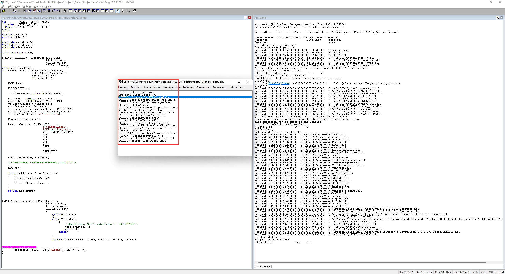

**BUILD WITH VS2012**

this is a simple message loop demo, it serves to discover `DispatchMessage ` call stack

you can `bp Project2!test_function` in windbg, when you click close on that window, bp will hit and you will be able to see the call stack of `DispatchMessage`, just like this:

